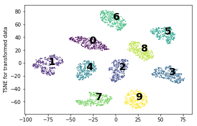
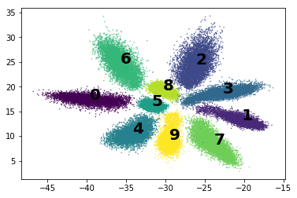

# Differentiable Boundary Trees
> Reproducing results in “Differentiable Boundary Trees” (DBT) paper.

> Tested with Python 2.7.14, TF 1.4.1 . To run, execute notebook `src/supervised_bset.ipynb`. See saved results at [results/supervised_bset.ipynb](results/supervised_bset.ipynb).

> If you choose to clone this repo make sure to run following command so that only the code related changes are commited for src/\*.ipynb files. This will ensure non-code related elements like plots and images in **cell outputs** are ignored. `git config --local include.path ../.gitconfig`.

## Background

* Original paper
    * Learning Deep Nearest Neighbor Representations Using Differentiable Boundary Trees
    * https://arxiv.org/pdf/1702.08833.pdf

*	Implementation is done on Python-TensorFlow using both Gradient Descent and Adam optimizers.

*	Test simulations were done on 3 datasets.
    * Half-moons dataset with 1000 training and 50 test data points.
    * Selected 2 classes in MNIST with 10924 training and 2041 test data points.
    * All 10 classes in MNIST with 60,000 training and 10,000 test data points.

*	All 3 datasets were tested on two classifiers.
    *	Baseline neural net classifier
    *	Differentiable Boundary Tree classifier
  
*	Half-moons dataset was tested on both classifiers with dropout ON and OFF.

*	Results of all simulations are included in the attached notebook.html document. Each simulation contains a piece of code describing model parameters such as learning rate, layers of neural net etc. Unless otherwise mentioned in the header, all simulations use Adam optimizer with dropout OFF.

## Some interesting results
1. DBT with half moons: Learned 2-dim representation.

2. DBT with MNIST: t-SNE visualization of learned 20-dim representation of 6,000 training points.

3. NN with MNIST: t-SNE visualization of learned 20-dim representation of 6,000 training points.

4. DBT with MNIST: t-SNE visualization of learned 20-dim representation of 20,000 training points.

5. DBT with MNIST: Learned 2-dim representation of 60,000 datapoints.

## Implementation details
*	Neural nets used for both classifiers are fully connected nets with ReLU activation function.

*	When implementing Differentiable Boundary Tree classifier, a simple Boundary Set (BS) was used instead of Boundary Tree (BT) structure proposed in the DBT paper. BS simply corresponds to the set of points in a BT without the tree structure. When training the BS, a training point is added with label to the set if the label of the closest point in the set is different. Only drawback is this involves in computing the distance from training point to all points in the set which grows linearly in number of points in the BS whereas in BT it grows in log(N). But the impact is minimal since the number of points used to train the BS in above simulations are below 1000. BS was chosen above BT due to simplicity of its implementation in TensorFlow for batch operations. Another advantage is BT is a suboptimal method for querying the closest point therefore BS should always produce same or better results.

*	When calculating the Softmax transition probability (equation-1 in DBT) ‘squared’ Euclidean distance was used instead of Euclidean distance. This is to mitigate an issue in the implementation that produces NaN results. Specifically, to calculate Euclidean distance, a square root operation must be applied as per the (equation-2 in DBT). Gradient of square root of x involves division by square root of x, which in this case is difference vector of two converging data points. Due to finite precision, few iterations into the training, the gradient with above division produces NaN values. Workarounds other than using ‘squared’ Euclidean distance include increasing precision to floating values of 64 bits (this also should fail at some point as x goes to zero) and adding a small constant to x before taking square root.

*	Following is helpful in interpreting the code used for each simulation in the notebook.
    *	n_samples: number of training samples, n_test: number of test samples, n_epochs: number of epochs
    *	regularizer: regularizer for neural net weights, learning_rate: learning rate of optimizer
    *	set_size: number of points used to train Boundary Set, batch_size: mini batch size for training
    *	dropout: keep probability of neurons, sigma: bandwidth parameter for softmax calculation
    *	dim_data: dimension of input data
    *	dim_layers: dimensions of hidden layers of neural net
    *	dim_inter: dimension of input for Boundary Set
    *	dim_pred: number of classes in training/test dataset

## Observations and issues
1.	The Boundary Tree algorithm appears difficult to implement in TensorFlow.
    *	Calculating class prediction using Boundary Tree requires traversing the tree and the traversal depth is not known in advance. It is difficult to implement this type of dynamic computing structure with TensorFlow without recreating the computation graph for each training sample. All results presented here are produced with Boundary Set instead of Boundary Tree.

2.	The two optimizers (Gradient Descent and Adam) produce different end results given enough iterations.
    *	Both optimizers were used to train the neural network classifier with other parameters kept same.
    *	Tests were done with smaller step sizes and large number of iterations till convergence is observed. With Adam having faster convergence properties, it is possible for two methods to converge to two different local minima (given loss of a neural net is highly non-convex).

3.	Training with dropout lead to undesirable results.
      * Two simulations were run with Half-moons dataset on neural net classifier with Adam optimizer. The final test error with dropout is slightly higher than that of without dropout. Also, the separation in transformed domain is not clear in the former case.

4.	As mentioned in the DBT paper, the test errors achieved for MNIST are 1.85% on Differentiable Boundary Tree classifier and 2.4% on neural net classifier. The results obtained in here are exact opposite, specifically **2.48%** on Differentiable Boundary Tree classifier and **1.84%** on neural net classifier. The Differentiable Boundary Tree classifier in this simulation consists a 2-hidden layer neural net with [784, 400, 400, 20] neurons and has the same structure what authors in DBT have used. For the neural net classifier, a 3-hidden layer neural net with [784, 400, 400, 20, 10] neurons was used in this simulation, whereas in DBT they have not mentioned its exact architecture.

## Open questions and next steps
1.	The Boundary Tree (BT) algorithm allows efficient nearest neighbor classification on labeled data. It has nice properties in terms of scaling and parallelizing for online Supervised Learning (SL). There exist many state-of-art Semi Supervised Learning (SSL) algorithms which are simply extensions of algorithms which are originally proposed for SL. We intend to explore how to extend BT (and DBT) to incorporate labeled and unlabeled data to formulate a SSL approach.

2.	One of the undesirable properties of BT includes heavy bias towards the initial training samples. This happens because the tree ‘discards’ all the new samples if they are close enough to ones existing in the tree. This effect is mitigated by Boundary Forest to a certain extent by selecting different starting points for each tree as training samples arrive in sequential manner. But it is still problematic since in a real-world application, initial training samples may not be random in the space of all possible samples therefore creating bias towards initial samples in all trees. A possible solution would be to take into account in some form, the ‘discarded’ samples when learning the tree.

3.	As mentioned in former sections, this simulation uses Boundary Set (BS) instead of Boundary Tree (BT) due to implementation feasibility. The cost of using BS instead of BT is having a greater query time. This is significant when the number of samples included in BT/BS is large. But even for datasets like MNIST and CIFAR-10, the BT/BS end up having only a small number of samples (around 20 to 30 as claimed in DBT). Due to the small numbers, using a BS in place of BT has a very little effect on speed of the algorithm. On the other hand, BS can very easily be implemented on existing platforms like TensorFlow with only one computing graph whereas BT requires building a different computing graph for each training sample.
